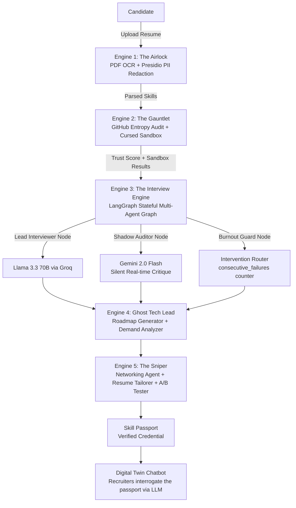

# CareerForge ⚔️

**The AI Career OS that fights AI with AI — verifying skills through adversarial code sandboxes so candidates can prove, not claim, their competence.**

[](https://github.com/Mannava-Daasaradhi/CareerForge/actions)
[](https://python.org)
[](https://nextjs.org)
[](https://fastapi.tiangolo.com)
[](https://langchain-ai.github.io/langgraph/)
[](LICENSE)
[](https://github.com/Mannava-Daasaradhi/CareerForge/commits/main)

[**Setup Guide**](#-quick-start) · [**Architecture**](#-architecture) · [**Sample Outputs**](#-sample-outputs) · [**Configuration**](#-configuration)

<!-- INSERT DEMO GIF HERE: record 60s of: upload resume → audit → run challenge → view Skill Passport -->
<!--  -->

---

## The Problem

AI tools have made it trivially easy to fake software skills. Candidates use ChatGPT to pass take-home tests, Copilot to complete coding challenges in real-time, and AI to fabricate convincing GitHub portfolios. Traditional ATS systems and human interviews can't reliably detect this — keyword matching on a resume tells you nothing about whether the person can actually code.

CareerForge fights AI with AI. It deploys a swarm of autonomous agents to **adversarially verify** skills — not just evaluate them — then compiles the results into a cryptographically-consistent **Skill Passport** that replaces unverifiable resume claims. The entire stack runs on free-tier infrastructure (Groq, Gemini Flash, Supabase), so there's no reason not to deploy it.

---

## 🏗 Architecture



**Agent topology:** The Interview Engine uses a LangGraph supervisor-worker graph with `MemorySaver` checkpointing. State — including burnout failure counters, shadow critique history, and conversation messages — survives across API calls. Three nodes run per turn: Lead Interviewer (Llama 3.3) → Shadow Auditor (Gemini) → Code Sandbox (Piston API).

---

## ⚙️ The 5 Engines

### Engine 1 — The Airlock (Resume Processing)
Ingests PDF resumes using a two-pass OCR pipeline: rasterize pages → Tesseract OCR, fall back to `pypdf` text extraction if OCR confidence is low. Presidio scans for PII (phone numbers, emails, SSNs) before any LLM sees the content.

> *Example output:* `"skills_detected": ["Python", "FastAPI", "Redis", "Docker"]`

### Engine 2 — The Gauntlet (Adversarial Verification)
Two sub-agents run in parallel:
- **GitHub Auditor** — scores accounts on age, push frequency, and repo count. Low-trust accounts (score < 50) trigger mandatory sandbox mode.
- **Cursed Sandbox** — generates *deliberately broken* code based on the candidate's claimed skills, then verifies their fix via the Piston API. You can't fake fixing code you don't understand.

> *Example output:* `"trust_score": 34, "verdict": "LOW_TRUST — Sandbox Mode Activated"`

### Engine 3 — The Interview Engine (LangGraph Multi-Agent)
A stateful LangGraph graph with three concurrent nodes:
- **Lead Interviewer** (Llama 3.3 70B via Groq) — dynamic prompt adapts based on Shadow Auditor critique
- **Shadow Auditor** (Gemini 2.0 Flash) — silently critiques each candidate answer; critique is injected into the next interviewer prompt
- **Burnout Guard** — tracks consecutive sandbox failures; routes to an intervention node when a candidate is clearly struggling

> *Example output:* `"shadow_critique": "Candidate used correct syntax but didn't consider edge case: empty list input"`

### Engine 4 — Ghost Tech Lead (Career Planning)
Generates a structured `CareerRoadmap` with weekly milestones, daily tasks, and curated resource links. The Demand Analyzer runs live DuckDuckGo searches to surface real job market trends for the target role.

> *Example output:* `"week_3": {"goal": "Deploy a Redis-backed FastAPI app", "daily_tasks": ["Read Redis data types docs", "Implement cache layer", ...]}`

### Engine 5 — The Sniper (Job Campaign)
Three coordinated agents:
- **Networking Agent** — generates proof-based cold outreach (references specific repo work, not generic praise)
- **Resume Tailor** — rewrites resume sections to match specific job descriptions
- **A/B Tester** — generates two resume variants and scores them against the JD

> *Example output:* `"variant_a_score": 82, "variant_b_score": 91, "recommendation": "Variant B — stronger skills-to-JD keyword alignment"`

---

## 📊 Sample Outputs

### GitHub Audit
```json
{
  "username": "torvalds",
  "trust_score": 100,
  "verdict": "VERIFIED — Elite Contributor",
  "account_age_years": 16.2,
  "push_events_30d": 47,
  "public_repos": 7,
  "top_repo": "linux",
  "sandbox_required": false
}
```

### Cursed Challenge Generation
```json
{
  "title": "The Generator That Forgot to Generate",
  "scenario": "Your senior dev handed you a 'working' pagination generator. It compiles. It runs. It returns nothing. Fix it before the demo.",
  "broken_code": "def paginate(items, page_size):\n    for i in range(0, len(items), page_size):\n        return items[i:i+page_size]",
  "constraint": "You may not use itertools. The fix must be a single character change.",
  "test_cases": [
    {"input": "[1,2,3,4,5], 2", "expected_output": "[[1,2],[3,4],[5]]"}
  ]
}
```

### Skill Passport
```json
{
  "username": "your-github-handle",
  "readiness_score": 74,
  "trust_score": 68,
  "challenges_passed": 3,
  "interview_sessions": 2,
  "skill_verdict": "VERIFIED — Mid-Level Backend",
  "verification_hash": "sha256:a3f9c2...",
  "generated_at": "2025-04-20T14:32:00Z"
}
```

### Career Roadmap Snippet
```json
{
  "target_role": "Backend Engineer",
  "total_weeks": 8,
  "milestones": [
    {
      "week": 1,
      "goal": "Redis fundamentals + caching patterns",
      "daily_tasks": [
        "Read Redis data types documentation",
        "Implement LRU cache for a FastAPI endpoint",
        "Practice pub/sub with a toy notification system"
      ],
      "resources": ["redis.io/docs", "realpython.com/python-redis"]
    }
  ]
}
```

---

## 🚀 Quick Start

### Prerequisites
- Python 3.11+
- Node.js 20+
- [Groq API key](https://console.groq.com/keys) (free)
- [Google Gemini API key](https://aistudio.google.com/app/apikey) (free)

**Windows — install system dependencies first:**
```powershell
# Install Tesseract OCR
winget install UB-Mannheim.TesseractOCR

# Install Poppler (for PDF rasterization)
# Download from: https://github.com/oschwartz10612/poppler-windows/releases
# Extract to C:\poppler and add C:\poppler\Library\bin to your PATH
```

**macOS:**
```bash
brew install tesseract poppler
```

**Ubuntu/Debian:**
```bash
sudo apt-get install tesseract-ocr poppler-utils
```

---

### 1. Clone
```powershell
git clone https://github.com/Mannava-Daasaradhi/CareerForge.git
Set-Location CareerForge
```

### 2. Backend setup
```powershell
Set-Location backend
Copy-Item .env.example .env
notepad .env          # Add your GROQ_API_KEY and GOOGLE_API_KEY

python -m venv venv
.\venv\Scripts\Activate.ps1
pip install -r requirements.txt
```

### 3. Database setup (optional — app runs in stateless mode without it)
```powershell
# Paste contents of supabase_schema.sql into your Supabase SQL editor
# Then add SUPABASE_URL and SUPABASE_KEY to backend/.env
```

### 4. Run backend
```powershell
uvicorn main:app --reload --port 8000
# Expected: INFO: Uvicorn running on http://0.0.0.0:8000
```

### 5. Frontend setup (new terminal)
```powershell
Set-Location ..\frontend
Copy-Item .env.local.example .env.local
notepad .env.local    # Add Supabase keys if using auth

npm install
npm run dev
# Expected: ▲ Next.js 16 — Local: http://localhost:3000
```

### 6. Verify it's working
```powershell
# Health check
Invoke-RestMethod -Uri "http://localhost:8000/" -Method Get
# → {"status":"active","mode":"stateful_agent"}

# GitHub audit
Invoke-RestMethod -Uri "http://localhost:8000/api/audit/torvalds" -Method Get

# Challenge generation
$body = '{"topic": "Python Generators", "difficulty": 70}'
Invoke-RestMethod -Uri "http://localhost:8000/api/challenge/new" `
  -Method Post -ContentType "application/json" -Body $body
```

### One-command Docker setup (alternative)
```powershell
# From repo root — requires Docker Desktop
docker compose up --build
# Frontend: http://localhost:3000
# Backend:  http://localhost:8000
```

---

## 🔧 Configuration

### Backend (`backend/.env`)

| Variable | Required | Description | Where to get it |
|---|---|---|---|
| `GROQ_API_KEY` | ✅ Yes | Llama 3.3 inference (Interview Engine) | [console.groq.com/keys](https://console.groq.com/keys) |
| `GOOGLE_API_KEY` | ✅ Yes | Gemini 2.0 Flash (Shadow Auditor) | [aistudio.google.com](https://aistudio.google.com/app/apikey) |
| `SUPABASE_URL` | ⬜ Optional | PostgreSQL + auth (stateless mode without it) | [supabase.com/dashboard](https://supabase.com/dashboard) |
| `SUPABASE_KEY` | ⬜ Optional | Service role key for DB writes | Same as above |
| `GITHUB_TOKEN` | ⬜ Optional | Prevents GitHub API rate limiting (60 req/hr without it) | [github.com/settings/tokens](https://github.com/settings/tokens) |
| `PISTON_API_URL` | ⬜ Optional | Code sandbox URL (defaults to public Piston) | [github.com/engineer-man/piston](https://github.com/engineer-man/piston) |

### Frontend (`frontend/.env.local`)

| Variable | Required | Description |
|---|---|---|
| `NEXT_PUBLIC_SUPABASE_URL` | ⬜ Optional | Supabase project URL (auth) |
| `NEXT_PUBLIC_SUPABASE_ANON_KEY` | ⬜ Optional | Supabase anon key (auth) |
| `NEXT_PUBLIC_API_BASE` | ✅ Yes | Backend URL (default: `http://localhost:8000/api`) |

---

## 📁 Project Structure

```
CareerForge/
├── backend/
│   ├── main.py                 # FastAPI entrypoint — 18+ routes
│   ├── graph.py                # LangGraph stateful interview graph
│   ├── agent_state.py          # InterviewState TypedDict
│   ├── interviewer.py          # Lead Interviewer node (Llama 3.3)
│   ├── shadow_auditor.py       # Silent critique node (Gemini)
│   ├── burnout_guard.py        # Failure counter + intervention router
│   ├── red_team.py             # Over-engineering detector node
│   ├── auditor.py              # GitHub trust scorer
│   ├── voice_processor.py      # Groq Whisper + confidence metrics
│   ├── challenge_generator.py  # Cursed Challenge generation
│   ├── code_sandbox.py         # Piston API execution node
│   ├── roadmap_generator.py    # Weekly roadmap structured output
│   ├── demand_analyzer.py      # Live market demand via DuckDuckGo
│   ├── skill_passport.py       # Verified credential aggregation
│   ├── negotiator.py           # Salary negotiation simulation
│   ├── networking_agent.py     # Proof-based cold outreach
│   ├── ab_tester.py            # Resume A/B variant generator
│   ├── kanban.py               # Job pipeline + rejection analysis
│   ├── job_fetcher.py          # AI-filtered job search
│   ├── recruiter_proxy.py      # Digital twin chatbot
│   ├── resume_parser.py        # OCR + PyPDF resume parser
│   ├── resume_tailor.py        # JD-targeted resume rewriter
│   ├── public_routes.py        # Public candidate profile routes
│   ├── background_worker.py    # Autonomous job hunt loop
│   ├── database.py             # Supabase client + offline fallback
│   ├── logger.py               # Shared structured logger
│   ├── supabase_schema.sql     # Full schema with RLS + triggers
│   ├── requirements.txt
│   └── .env.example
│
├── frontend/
│   └── src/
│       ├── lib/api.ts          # Typed API client
│       ├── components/
│       │   └── Navbar.tsx
│       └── app/
│           ├── page.tsx        # Landing page
│           ├── login/          # Supabase auth
│           ├── dashboard/      # Career command center
│           ├── interview/      # Voice + text interview UI
│           ├── resume/         # Upload/audit/tailor/AB tabs
│           ├── challenge/      # Cursed Sandbox UI
│           ├── roadmap/        # Skill tree roadmap
│           ├── kanban/         # Drag-drop job pipeline
│           ├── hunter/         # AI job search
│           ├── negotiator/     # Salary negotiation sim
│           ├── outreach/       # Cold email generator
│           ├── passport/       # Skill Passport viewer
│           ├── recruiter/      # Digital twin chat
│           ├── experiments/    # Resume A/B tester
│           └── candidate/[username]/ # Public profile
│
├── docker-compose.yml
├── LICENSE
└── Readme.md
```

---

## 🗺 Roadmap

- [ ] **Voice stress analysis via audio features** — current confidence score uses transcribed text (filler word counts); real signal is in pitch variance and pause duration via `librosa`
- [ ] **Commit entropy analysis** — GitHub Auditor claims to detect AI-generated code; actual diff-entropy measurement (character-level entropy of commit diffs) is not yet implemented
- [ ] **Skill Passport as a shareable URL** — `/candidate/{username}` exists; needs real passport data + public access so candidates can link it from their resume
- [ ] **Background worker deployment** — `background_worker.py` runs autonomously but needs `APScheduler` for reliable cron-style execution with retry
- [ ] **Full PII redaction in interview logs** — Presidio is integrated for resume parsing; extend to transcript storage
- [ ] **Semantic search over passport history** — Supabase has `pgvector` enabled; use it to find similar past candidates for recruiter comparisons
- [ ] **SqliteSaver checkpointer** — replace `MemorySaver` for single-server persistence that survives restarts
- [ ] **Benchmark results** — run auditor against 50 AI-slop accounts vs 50 genuine contributors; publish confusion matrix

---

## 🤝 Contributing

See [CONTRIBUTING.md](CONTRIBUTING.md) for how to add new agents, wire new LangGraph nodes, and contribute frontend pages.

---

## 📄 License

MIT — see [LICENSE](LICENSE).
